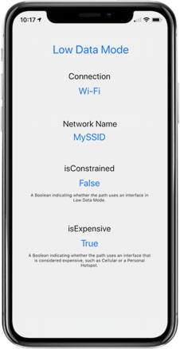

## Low Data Mode

This is a sample app built in swift that displays whether you're connected to an expensive network, or a constrained network.  This sample app demonstrates the use of the Network framework.  It was used to test whether a hot spot connection does in fact make the network "expensive".

### Preview

### License

This project is available under the MIT license. See the LICENSE file for more info.
